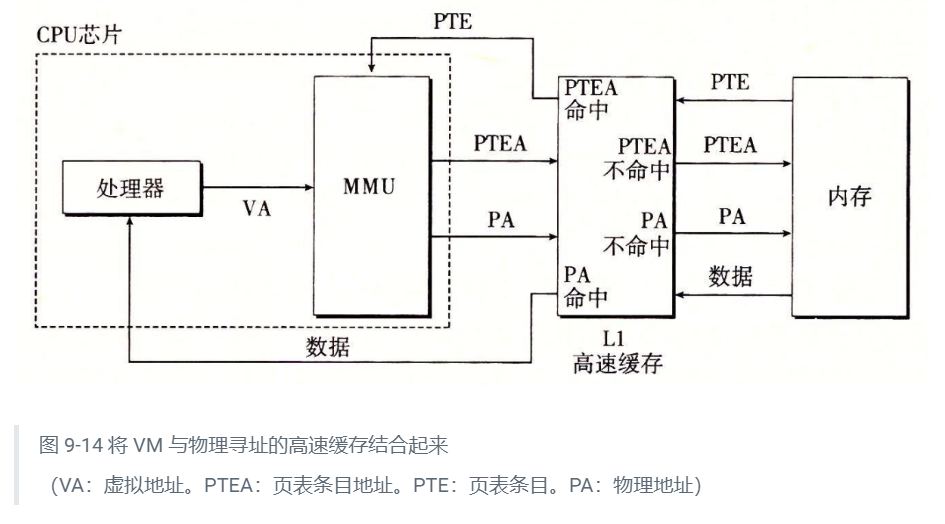

## 虚拟内存

### 9.1 物理和虚拟寻址

CPU通过虚拟内存来访问物理内存，在访问物理内存之前需要先将虚拟地址转换为物理地址。将虚拟地址转换为物理地址的过程称为**地址翻译**。地址翻译需要CPU硬件和操作系统之间的紧密合作。CPU上有一个芯片叫做内存管理单元（MMU），它利用存放在物理内存上的查询表来动态的翻译虚拟地址，该表的内容由操作系统管理。

### 9.3 虚拟内存作为缓存的工具

#### 9.3.2页表

虚拟页对应的物理页不是都放在内存当中的，有一部分是放在磁盘当中的，如果虚拟页与对应的物理页没有在内存当中，而是在磁盘上，那么就在内存中选择一个牺牲的物理页换出到磁盘上，然后将磁盘中的物理页换入到这个内存中的这个位置。

#### 9.3.3 页命中

如果虚拟页对应的物理页在内存中即命中，如果在磁盘上即未命中（缺页）

#### 9.3.4 缺页

虚拟页通过地址翻译硬件找到对应的页表条目，如果发现其有效位为0（即未缓存在内存中），从有效位可以推断出页面未被缓存在内存中，那么就会触发缺页异常。缺页异常将调用内核中的缺页异常处理程序，然后选择一个内存中的物理页换出，然后将需要的内存页换入到内存当中，然后缺页异常处理程序还有更新页表中的内容。最后当异常处理程序返回时，它会重新启动导致缺页的命令。

#### 9.3.5 分配页面

例如使用malloc分配虚拟内存，分配的内容在VP5（虚拟页5）中，这个分配过程是在磁盘上创建空间，并且更新页表中的页表条目。

#### 9.3.6 又是局部性救了我们

我们对虚拟内存的第一印象是效率应该会特别低，因为如果我们在内存中没有命中的话，那么就需要频繁的换入换出物理页，这样的话程序的效率因该就会特别低（磁盘的读写是很慢）。

但是实际上虚拟内存工作的很好，这主要归功于局部性原理。局部性原理保证了在任意时刻，程序将趋向于在一个较小的活动页面的集合上进行工作，这个集合叫做工作集或者常驻集合。

如果工作集的大小超出了物理内存的大小，那么程序将会产生一种不幸的状态，这种状态叫做**抖动**，这时页面将会频繁的换入换出，那么此时程序的运行效率会很低。

### 9.4 虚拟内存作为内存管理的工具

虚拟内存大大简化了内存管理，而且提供了一种自然的保护内存的方法。

实际上，操作系统为每个进程提供了一个独立的页表

多个虚拟页面可以映射到同一张物理页面上（可以实现内存共享)

将一组连续的虚拟页映射到任意一个文件中的任意一个位置的表示法成为内存映射。Linux系统中提供了一个内存映射的系统调用mmap

### 9.5 虚拟内存作为内存保护的工具

操作系统必须为内存提供保护，比如说一个程序不允许访问和修改内核中的代码和数据结构，不能够访问和修改其他程序的私有内存，也不能修改任何与其他程序共享的内存。

例如我们看到的，为每个进程提供了独立的地址空间就能很容易的区分不同进程的内存空间。我们也可以在页表中的页表条目（PTE)上添加一些额外的许可位来控制进程对内存的访问权限。

### 9.6 地址翻译

MMU如何利用页表来实现地址翻译(映射)

cpu中有一个页表基址寄存器（Page Table Base Register PTBR)，这个页表基址寄存器指向当前页表的位置。

一、页面命中时的步骤：

1. CPU处理一个虚拟地址，然后将这个虚拟地址传送给MMU
2. MMU生成一个页表条目地址（Page Table Entry Address PTEA)，然后将页表条目地址传给内存或者高速缓存
3. 内存或者高速缓存通过页表条目地址找到相应的页表条目（页表条目内记录了有效位和物理页号（PPO）），并将页表条目传给MMU
4. MMU通过页表条目获取物理页号，在物理页号的基础上再加上虚拟页偏移（VPO），就构成了物理地址，然后MMU将物理地址传给内存或者高速缓存
5. 内存或者高速缓存将数据发送给CPU

页面命中的情况下完全是由硬件来处理的，与之不同的是，处理缺页需要硬件和OS的配合完成

二、页面未命中的情况：

第一步到第三步与上面页面命中的情况一致

4. MMU发现传送过来的页表条目的有效位为0，表示虚拟页对应的物理页未命中（没有在内存或者高速缓存中），然后将会触发缺页异常，然后将调用操作系统内核中的缺页异常处理程序
5. 缺页异常处理程序确定将要被换出的牺牲页，并将其换出
6. 缺页异常处理程序将未命中的页面调入到内存当中，并更新内存中的页表条目（PTE）
7. 缺页异常程序返回到原来的进程，再次执行导致异常的命令

#### 9.6.1 结合高速缓存和虚拟内存

首先向高速缓存发送PTEA，如果缓存中存在就返回PTE，如果不存在就再访问内存，然后返回页表条目（PTE）。

接着MMU生成物理地址，将物理地址发送到缓存，如果缓存命中，则返回数据，如果没有命中，就再向内存发送物理地址，然后传回数据到CPU中。

#### 9.6.2 利用TLB加速地址翻译

如上述所描述的那样，每次我们产生一个虚拟地址的时候，MMU就必须查阅一个PTE，以便将虚拟地址翻译成物理地址。这样的话我们每次就需要多发送一次内容，最坏的情况下我们需要在内存中多取一次数据（从内存中取PTE），那么开销就是几十到几百个周期。如果PTE刚好在一级缓存中，那么开销会下降到1个或2个周期。

即使是这样，很多系统也试图消除这样的开销。所以就在MMU包括了一个小的缓冲区TLB（Translation Lookaside Buffer)用来存放PTE

这样的话，如果TLB命中的话，那么我们的地址翻译就会在MMU中完成，因为MMU在CPU当中，所以运行效率会特别高。

如果没有命中的话，就会依次访问高速缓存和内存，直到找到为止。

#### 9.6.3 多级页表

到目前为止，我们一直假设系统只使用一张单独的页表。但是如果我们假设系统为32位，每个页面的大小为4KB，那么我们这个页表就会有1M（2^32 / 2^12 = 2^20)个页表条目（PTE），如果每个页表条目为4B，那么我们每个进程内都需要1M * 4 = 4MB的空间来当作页表。这个内存的消耗是非常恐怖的。如果是64位操作系统的话，情况会更严重（64位系统的虚拟地址位数一般是48）

用来压缩页表的方法是使用层次结构的页表（多级页表）。

举个例子，我们使用两级页表，一级页表中每个页表条目（PTE）对应一个4MB的片（chunk），每个片（chunk）都是由1024个连续的页面组成的。那么4GB的内存空间最多可以使用1024个PTE来表示。（1024 * 4MB == 4GB）

二级页表中的每个页表条目对应一个页面（4KB）

如果一个片i中的每个页面都未被分配，那么片i的页表条目（PTE i）就为null。如果片中至少有一个页面被分配内存，那么PTE就指向一个二级页表的基地址

每个一级页表和二级页表都是4KB。

这种方法从两个方面减少了内存需求。

第一是因为如果片内没有分配内存，那么二级页表就不会存在。这代表着一种巨大的节约，因为对于一个程序来说，4GB的虚拟内存大多是未分配的。

第二是因为只有一级页表总是放在内存中。只有最需要使用的二级页表才需要缓存在内存中。

### 9.7 案例研究：Intel Core i7/Linux内核系统

Linux 使用4KB的页

#### 9.7.1 Core i7地址翻译

Core i7支持4级页表

页表的格式是从低位到高位包含各种标志位和物理页表基地址

地址翻译过程：

四级页表，每个页表号被划分为四个片，每个片占九位，每个片可以用作一个页表的偏移量

先从CR3中找到一级页表的基地址，然后通过虚拟页表号1（从左到右前9位）得到偏移量，结合页表基地址和偏移量，可以找到一个一级PTE（页表条目），这个PTE中包含了二级页表的基地址。

二级页表基地址加偏移量（VPN的第10-18位）可以得到二级页表的页表条目，以此类推，可以找到四级页表的PTE。四级页表的PTE包含物理页的基地址。物理页基地址加上虚拟页的偏移量可以找到物理地址。

执行过程如下图所示：

#### 9.7.2 Linux 虚拟内存系统

Linux为每个进程分配了一个单独的虚拟地址空间（从低到高依次包括代码段，数据段，bss段，堆区，共享区，栈区，内核虚拟内存）

内核虚拟内存包含内核中的代码和数据结构。内核中的某些区域被映射到所有进程共享的物理页面，比如说每个进程共享的内核代码和数据结构。

内核中的另外一些区域包含每个进程都不相同的数据，比如说页表，切换上下文时所需要的栈

1. Linux虚拟内存区域

   每个虚拟页面都保存于某个区域当中（代码段，数据段，堆栈等等）

   内核为每个进程都维护了一个单独的任务结构（源码中的task_struct)。任务结构中包括或者指向运行该进程所需要的所有信息。（例如PID，指向用户栈的指针、程序计数器）

   任务结构中的一个条目指向mm_struct，它描述了当前虚拟内存的状态。

   mm_sturct中有两个字段（mm_struct中不止有这两个），pgd（page global directory)和mmap

   pgd指向一级页表（页全局目录）的基地址，mmap指向一个vm_area_structs（区域结构）的链表，每个区域结构都描述了虚拟空间中的一个区域

   vm_area_structs（区域结构）包含以下字段:

   - vm_start 区域的起始处

   - vm_end 区域的结束出

   - vm_prot 区域中所包含的所有页的读写许可权限

   - vm_flag 描述页面时共享的还是私有的（对于进程而言）

   - vm_next 指向下一个区域的指针

     Linux是如何组织虚拟内存的（如下图所示）：

   

2. Linux缺页异常处理

   缺页异常处理先要看虚拟地址是否合法（是否在某一个区域内）

   如果合法再看是否有权限可以读写

   如果合法，就换出一个页面，然后换入缺失的页面

   

### 

### 9.8 内存映射

虚拟内存区域与磁盘上的对象关联起来，以这个方式初始化虚拟内存，这个过程叫做内存映射。

虚拟内存可以映射到两类文件：

一类是普通文件，一类是匿名文件

#### 9.8.1 再看共享对象

共享对象就是就一个对象映射到多个进程的虚拟内存区域内。多个进程都可以共享这一对象，也可以进行写操作，如果映射的内容被改变后，其他进程所看到的内容也将改变

私有对象就是多个进程可以共享读一个对象，如果一个进程要进行写操作，那么就会将被修改的页面拷贝一份到物理内存中（这样将会节约大量的空间），这种技术叫做写时拷贝（copy on write)

#### 9.8.2 再看fork函数

调用fork函数时将创建一个新的进程，然后分配给进程一个PID，然后会创建当前父进程的mm_struct、区域结构、页表的副本（子进程和父进程共享用户区数据），只有在写时才拷贝出一份新的页面。

#### 9.8.3 再看evecve函数

evecve用来加载和执行程序：

执行步骤：

1. 删除已经存在的用户区
2. 映射私有区域，将数据加载到私有区域内。
3. 映射共享区域（共享区的内容）
4. 设置程序计数器（PC）指向程序的入口处

